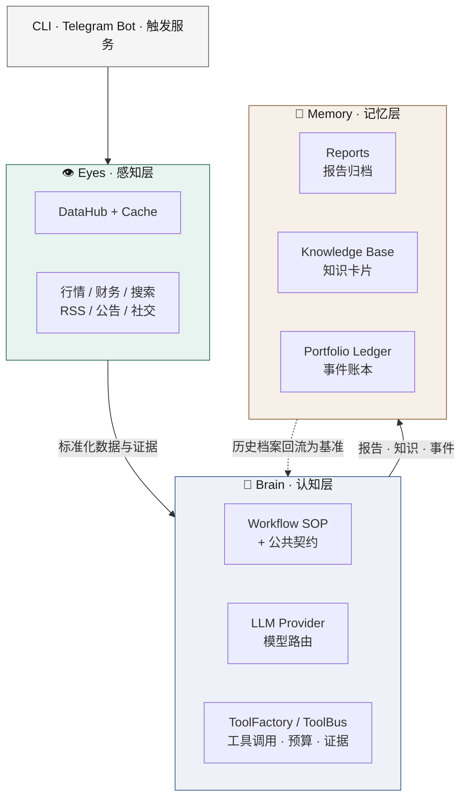
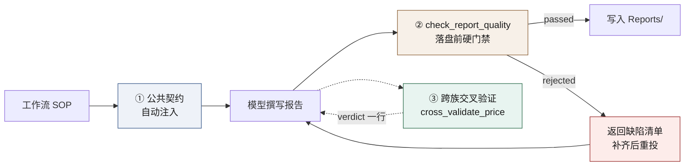

<div align="center">

# AlphaSystem

**可审计、可复用的 AI 投资研究工作台**

把多源市场数据、LLM 驱动的研究 SOP、知识沉淀、组合账本与执行风控，
收敛成一条**每个结论都能回溯到证据**的研究链路。

<br>


[快速开始](#-快速开始) ·
[系统架构](#-系统架构) ·
[研究工作流](#-研究工作流) ·
[质量保障](#-研究质量保障) ·
[数据获取](#-数据获取) ·
[配置](#-配置) ·
[路线图](#-路线图)

</div>

> [!IMPORTANT]
> AlphaSystem 面向个人研究与工程实验，**不构成投资建议**，也不保证数据、模型输出或交易执行的准确性。涉及资金的操作必须由使用者独立核验并自行承担风险。

> [!NOTE]
> 仓库尚未提供 `LICENSE` 文件。在许可证补充前，请不要默认将代码视为已获得标准开源授权。

---

## 为什么是 AlphaSystem

传统投研工具把数据采集、分析提示词、报告归档和交易记录散落在不同应用里，结论一旦写下就与它的证据脱钩。AlphaSystem 把这四件事串成一条链，并在每个接缝处加了代码级约束。

<table>
<tr>
<td width="50%" valign="top">

### 🔍 证据可回溯

每份报告必须带证据台账、来源层级与抓取时间。落盘前由 `check_report_quality` 逐项校验，缺章节、无来源、只有单边观点一律拒绝写入。

</td>
<td width="50%" valign="top">

### ⚖️ 交叉验证按「来源族」判定

腾讯、东财、新浪转发的是同一份交易所行情——它们互相比对得到的 0.00% 偏差不是高可信度，是同一份数据比了两遍。系统按族判独立性，未交叉时如实申报单源。

</td>
</tr>
<tr>
<td width="50%" valign="top">

### 📐 SOP 而非提示词

17 个研究工作流把市场扫描、个股深研、事实核查、交易审计与组合复盘固化为可复用流程，公共契约自动注入每一个，无需在各工作流里重复。

</td>
<td width="50%" valign="top">

### 🛡️ 建议与执行之间有闸门

订单进入适配器前依次经过 KillSwitch → GuardChain → Wallet；仓位上限、交易冷却与反向冷却是代码，不是提醒。

</td>
</tr>
</table>

---

## 🚀 快速开始

需要 **Python 3.10+**。

```bash
git clone https://github.com/zx2592/Research.git && cd Research

python3 -m venv .venv && source .venv/bin/activate      # Windows: py -m venv .venv && .venv\Scripts\Activate.ps1
python -m pip install --upgrade pip
python -m pip install -r requirements.txt

cp .env.example .env        # 填入 GEMINI_API_KEY 与 TAVILY_API_KEY
```

跑通第一个工作流：

```bash
python research_cli.py scan            # 市场全景扫描
python research_cli.py deep NVDA       # 个股深度研究
python research_cli.py verify "某公司将在下季度推出新产品"
```

<details>
<summary><b>可选：个人配置与扩展依赖</b></summary>

<br>

真实持仓、投资画像与自选清单都由 `.gitignore` 排除，从模板复制即可：

```bash
cp Config/holdings.example.json Config/holdings.json
cp Memory_Layer/Investment_Persona.example.md Memory_Layer/Investment_Persona.md
cp watchlist.json.example watchlist.json
```

bb-browser / Playwright MCP 集成需要 Node.js 依赖：

```bash
npm install
```

少数旧版抓取器及其测试依赖未包含在基础依赖中的可选包：

```bash
python -m pip install sec-edgar-downloader praw
```

> 提交前跑一次 `git status`，确认没有密钥、账户信息、持仓或研究报告进入暂存区。

</details>

---

## 🏛 系统架构

**Eyes – Brain – Memory** 三层，把「获取信息、形成判断、积累认知」拆成可替换的模块。



核心链路之外有三个可选子系统：

| 子系统 | 位置 | 职责 |
|:---|:---|:---|
| **执行管线** | `services/execution/` | `KillSwitch → GuardChain → Wallet → Adapter → Ledger`，CLI 默认装配 `PaperAdapter` |
| **组合服务** | `services/portfolio/` | SQLite 事件账本、CSV 导入、持仓快照与健康度计算 |
| **触发引擎** | `services/trigger/` | 把定时、价格异动与财报临近事件路由到工作流，含去重与冷却 |

---

## 📋 研究工作流

`research_cli.py` 的 dispatch 表覆盖 **17 个用户工作流**。每个工作流是一份 Markdown SOP（`.agent/workflows/`），运行时由 `WorkflowRunner` 拼上公共契约、联网日期与 RSS 上下文后注入模型。

### 市场发现

| 命令 | 参数 | 作用 | 产物 |
|:---|:---|:---|:---|
| `scan` | — | 多源市场全景扫描，可复现体温计分，识别主题收敛与结构性机会 | `Reports/YYYYMMDD/*_Market_Scan.md` |
| `lead` | `[关键词]` | 雪球 / Reddit / KOL 情绪共振审计，强制 ≥60% 新发现线索 | `*_Market_Lead.md` |
| `theme` | — | A 股主题发现与标的分层（龙头 / 核心 / 潜伏） | `*_Theme_Scan.md` |
| `core` | — | 核心持仓实时刷新与逻辑稳固度审计 | `*_Core_Report.md` |

### 个股研究

| 命令 | 参数 | 作用 | 产物 |
|:---|:---|:---|:---|
| `deep` 🔵 | `Ticker` | 商业模式 → 财务与估值 → 多空压力测试 → 监控清单，含评级记分卡 | `Reports/deepdive/*_Deep.md` |
| `value` 🔵 | `Ticker` | 质量复利框架（巴菲特 / 李录 / 段永平 / 达尔文）+ 六视角对撞 | `Reports/deepdive/*_Value.md` |
| `quick` | `Ticker + 事件` | 事件快评：信息分级、Priced-in 判断、双轨策略 | `*_Quick.md` |
| `update` | `Ticker` | 定期补课，**关键变化**是其心脏：和上次基准比什么变了 | `*_Update.md` |
| `verify` | `声明` | 一手源回溯与交叉验证，给出确认 / 证伪 / 存疑判决 | `*_Verify.md` |

### 交易决策

| 命令 | 参数 | 作用 | 产物 |
|:---|:---|:---|:---|
| `buy` | `Ticker` | 组合风险预算闸门 → 板块 Beta 熔断 → 股性 → 行动价 → 盈亏比与 IRR 双门槛 | `*_Buy.md` |
| `sell` | `Ticker` | 入场定性回溯、5 类卖出信号扫描、纪律合规与风格漂移自检 | `*_Sell.md` |
| `option` | `Ticker + 目标` | Covered Call / Cash-Secured Put / Protective Put 三场景 | `*_Option.md` |
| `macro` | `[事件]` | 三维压力测试 + 流动性水管量化（MOVE / SOFR / 净流动性 / OAS） | `*_Macro_*.md` |

### 组合与复盘

| 命令 | 参数 | 作用 | 产物 |
|:---|:---|:---|:---|
| `position` | — | 量化绩效仪表盘、收益归因、研究新鲜度、相关性与再平衡清单 | `*_Position_Analysis.md` + Tearsheet |
| `optimize` | `[method]` | `max_diversification`（默认）/ `minvol` / `maxsharpe` / `riskparity` 生成调仓交易清单 | `*_Optimize_*.md` |
| `rethink` | `[Ticker]` | 知行合一检查、运气 vs 实力归因，漏洞写入 `Feedback_Loop/` | `*_Rethink.md` |
| `add` | — | 从最近研究提取知识卡片写入本地知识库 | `Memory_Layer/Knowledge_Base/` |

> 🔵 = 使用 Pro 模型（`ResearchAgent.PRO_WORKFLOWS = {"deep", "value"}`），其余走常规模型。
> 另有两个辅助命令：`insight`（`scan` 的别名）与 `push [Ticker ...]`（纯 Python 信号推送，不启动 LLM）。

---

## ✅ 研究质量保障

报告的价值取决于它能不能被复核。AlphaSystem 把这件事从「提示词里提醒一句」变成三层代码级约束。



### ① 公共契约自动注入

`.agent/workflows/common/` 下三份契约由 `WorkflowRunner.load_common_rules()` 拼接在每个工作流之前：

| 契约 | 约束内容 |
|:---|:---|
| `00-report-contract.md` | 八个必备章节、结论先行的一行判决、**价格证据行**、关键变化与数字底稿 |
| `10-evidence-contract.md` | T1–T4 来源分级、分市场数据源优先级、来源族、误差分档、股价复权口径 |
| `20-quality-gate.md` | 出报告前 8 问自检与印章、落盘前逐项复核表、历史报告冲突门禁 |

### ② 落盘前的硬门禁

`write_to_file` 写入 `Reports/**/*.md` 时先跑 `check_report_quality`：

<table>
<tr><th align="left">检查项</th><th align="left">不合格条件</th></tr>
<tr><td>章节完整性</td><td>缺结论先行 / 实时数据快照 / 证据台账 / Bull-Base-Bear / 行动计划 / 风险与不确定性 / 质量自检</td></tr>
<tr><td>可核验性</td><td>无顶层标题、无显式日期、无任何来源引用、正文过短</td></tr>
<tr><td>双边视角</td><td>全篇没有反方（Bear / 空方）表述</td></tr>
<tr><td>历史冲突</td><td>与同一标的的历史报告出现动作反转或关键数据方向反转，却没有 <code>## 冲突解释</code></td></tr>
</table>

任一条不过即拒绝写入，并返回 `missing_sections` 与 `issues` 清单——按清单改完重投，不要换个说法再试。

### ③ 跨族交叉验证

「取到两个数」不等于「交叉验证过」。`cross_validate_price` 的 `passed` 需**同时**满足三条：

1. 至少两个**不同来源族**给出数值；
2. 跨族偏差在容差内；
3. 跨族数值**不完全相同**——两个真正独立的来源（一家用最新成交、一家用官方收盘）几乎不可能分毫不差。

未通过不是错误，是**未过项**：报告照常写，如实申报单源，但不得给出目标价、止损与盈亏比。工具返回的 `verdict` 是一句可以直接抄进报告结论区的话：

```text
✅  价格证据：1502 · 2 源已交叉，偏差 0.13%（fetch_market_prices / tencent:qt.gtimg.cn，2026-08-23T07:31Z）

⚠️  价格证据：153.7 · 单源未交叉（fetch_market_prices）——所有读数来自同一来源族，
    互相比对不构成交叉；本次不得给出目标价、止损与盈亏比

⚠️  价格证据：153.7 · 疑似同源，按单源处理——跨族读数完全相同（偏差 0.00%）
```

财务指标走同一套逻辑（`cross_validate_metric`），按误差三档给结论：

| 误差 | 判定 | 处理 |
|:---:|:---|:---|
| ≤ 1% | ✅ 一致 | 取共识值（中位数），标注两个来源 |
| 1% – 5% | ⚠️ 存在差异 | 并列写出两个数值，说明可能原因（GAAP / Non-GAAP、汇率、财年定义、合并口径） |
| > 5% | ❌ 重大差异 | 必须回原始披露核实，**不得直接使用** |

---

## 🌐 数据获取

### 来源族：什么才算「独立的第二个来源」

| 族 | 成员 | 说明 |
|:---|:---|:---|
| `intl-vendor` | Yahoo / yfinance / `fetch_market_prices` | 国际行情供应商链路 |
| `cn-exchange-relay` | 腾讯、东财、新浪、同花顺、雪球、Tushare | 都在转发同一份交易所行情 |
| `tw-vendor` | FinMind、Goodinfo | 台股 |
| `primary-disclosure` | 交易所公告、巨潮、HKEXnews、SEC、公司 IR | 一手披露，冲突时以它为准 |

同族之间再多来源也按单源处理；真正的交叉必须跨族。

### 分市场取数优先级

**先走结构化接口，再走网页正文**——从新闻或研报正文里读营收、现金流、ROIC，是数字出错的第一现场。

| 市场 | 主源 | 副源（交叉用） | 一手披露 |
|:---|:---|:---|:---|
| A 股 | `get_financials()` 东财结构化年报（已直连） | 巨潮资讯 | 交易所公告 / 年报 PDF |
| 美股 | macrotrends | stockanalysis | SEC EDGAR 10-K / 10-Q |
| 港股 | aastocks | macrotrends（ADR 代码） | HKEX 披露易 |
| 台股 | FinMind | Goodinfo | 公开资讯观测站 MOPS |

### 数据源适配器

| 来源 | 用途 | 配置 |
|:---|:---|:---|
| **yfinance** | 多市场行情与财务 | `yfinance` 包 |
| **腾讯行情** | A股 / 港股 / 美股实时快照，交叉验证的跨族第二源 | 无需配置（stdlib 直连） |
| **东方财富** | A股 52 周区间、估值指标、结构化年报 | 无需配置（stdlib 直连） |
| Tushare | A 股行情、基本面与公告 | `TUSHARE_TOKEN` |
| Tavily / Brave | 主力 / 备用网页搜索 | `TAVILY_API_KEY` / `BRAVE_SEARCH_API_KEY` |
| RSS / RSSHub | 订阅与被动情报 | 可选 `RSSHUB_BASE` |
| OpenBB | 标准化金融数据 | OpenBB 包或本地服务 |
| opencli | 雪球 / Reddit / X 等多站点适配 | Node.js 运行时 |
| bb-browser | 浏览器与社交数据 | Playwright MCP |
| Kanzhiqiu | 社区摘要集成 | 本地客户端 |

> CLI 默认注册 **bb-browser、opencli、yfinance、腾讯行情、东方财富**；其余由脚本、ToolFactory 或调用方按需启用。
> 腾讯行情与东方财富只用 stdlib（urllib 直连，失败回退 `curl --noproxy`），**不需要 token**。

---

## 🧰 LLM 工具箱

`ToolFactory` 向模型暴露 **19 个工具**。Gemini 走自动函数调用，OpenAI 兼容 Provider 通过手动工具循环使用同一组 Python 可调用对象。

| 分类 | 工具 |
|:---|:---|
| **取数与取证** | `search_web` · `browser_fetch` · `browser_operate` · `drill_source` · `learn_source` |
| **行情与验证** | `get_realtime_quote` · `cross_validate_price` · `cross_validate_metric` · `verify_market_cap` · `get_financials` |
| **报告与文件** | `read_file` · `list_dir` · `write_to_file` · `check_report_quality` |
| **组合与交易** | `get_portfolio_snapshot` · `preview_trade` · `execute_trade` |
| **运行时** | `execute_python_script` · `system_doctor` |

---

## 💼 组合与执行

### 事件账本

基于 SQLite 的事件溯源账本，全程使用 `Decimal` 计算，持仓状态可由事件回放重建。CSV 导入器支持券商流水入账。

### 执行护栏链

```mermaid
flowchart LR
    I["OrderIntent"] --> K["KillSwitch<br/>全局急停"]
    K --> G1["MaxPositionGuard<br/>单票 ≤ 15% NAV"]
    G1 --> G2["CooldownGuard<br/>同标的 24h 冷却"]
    G2 --> G3["ReverseCooldownGuard<br/>卖出后 30 天禁买回"]
    G3 --> W["Wallet<br/>资金校验"]
    W --> A["Adapter<br/>默认 PaperAdapter"]
    A --> L["Ledger 落账"]

    style K fill:#fdecea,stroke:#9b2c2c,color:#1a1a1a
    style G1 fill:#f7f0e8,stroke:#8c6239,color:#1a1a1a
    style G2 fill:#f7f0e8,stroke:#8c6239,color:#1a1a1a
    style G3 fill:#f7f0e8,stroke:#8c6239,color:#1a1a1a
    style A fill:#e8f4f0,stroke:#2f6f4e,color:#1a1a1a
```



阈值集中在 `core/settings.py`，全部可用环境变量覆盖：

| 护栏 | 默认值 | 环境变量 |
|:---|:---:|:---|
| 单票仓位上限 | 15% NAV | `GUARD_MAX_POSITION_PCT` |
| 同标的交易冷却 | 24 小时 | `GUARD_COOLDOWN_HOURS` |
| 反向交易冷却 | 30 天 | `GUARD_REVERSE_COOLDOWN_DAYS` |

### 主动触发

`trigger_service.py` 把事件路由到研究工作流，并执行去重与冷却：

| 触发源 | 条件 | 冷却 | 环境变量 |
|:---|:---|:---:|:---|
| 价格异动 | 日内涨跌幅 ≥ 3.5% | 4 小时 | `TRIGGER_PRICE_MOVE_PCT` |
| 财报临近 | 距财报 ≤ 7 天 | 24 小时 | `TRIGGER_EARNINGS_WINDOW_DAYS` |
| 定时晨扫 | 计划任务 | 6 小时 | `TRIGGER_MORNING_SCAN_COOLDOWN` |
| 持仓复盘 | 计划任务 | 24 小时 | `TRIGGER_POSITION_REVIEW_COOLDOWN` |

---

## 🖥 使用入口

<table>
<tr>
<th align="left" width="20%">入口</th>
<th align="left">说明</th>
</tr>
<tr>
<td valign="top"><b>CLI</b><br/><sub>覆盖最完整</sub></td>
<td>

```bash
python research_cli.py scan
python research_cli.py quick TSLA "Robotaxi 发布会"
python research_cli.py buy NVDA
python research_cli.py optimize riskparity
python research_cli.py push SPOT GOOG      # 纯 Python，不启动 LLM
```

</td>
</tr>
<tr>
<td valign="top"><b>Telegram Bot</b></td>
<td>

配置 `TELEGRAM_BOT_TOKEN` 与 `TELEGRAM_CHAT_ID` 后 `python bot/bot_service.py`。
注册了 `/scan` `/deep` `/value` `/quick` `/verify` `/add` `/update` `/insight` `/theme` `/buy` `/sell` `/position` `/rethink` `/reset`，以及 `/morning` `/earnings` `/weekly` 三个自动化任务入口；非命令文本走自由对话。

</td>
</tr>
<tr>
<td valign="top"><b>触发服务</b></td>
<td>

```bash
python trigger_service.py --poll-seconds 120 --disable-price
```

事件转工作流调用；是否推送 Telegram 取决于本地配置。

</td>
</tr>
</table>

---

## ⚙️ 配置

完整模板见 [`.env.example`](.env.example)。配置值由 `core/config.py` 读取，业务阈值集中在 `core/settings.py`。

### LLM Provider

| `LLM_PROVIDER` | Key | 常规模型 | Pro 模型 |
|:---|:---|:---|:---|
| `gemini`（默认） | `GEMINI_API_KEY` | `gemini-3-flash` | `gemini-3.1-pro` |
| `openai` | `OPENAI_API_KEY` | `gpt-4o-mini` | `gpt-4o` |
| `openrouter` | `OPENROUTER_API_KEY` | `openai/gpt-4o-mini` | `openai/gpt-4o` |
| `qwen` | `QWEN_API_KEY` / `DASHSCOPE_API_KEY` | `qwen-plus` | `qwen-max` |

Gemini 支持 `GEMINI_API_KEY_BACKUP` 自动回退。三家 OpenAI 兼容 Provider 共用 `core/llm_providers.py` 的适配器，工具调用经手动循环驱动，轮数上限由 `TOOL_LOOP_MAX_ITERATIONS`（默认 15）控制。

<details>
<summary><b>其他可调阈值</b></summary>

<br>

| 变量 | 默认 | 含义 |
|:---|:---:|:---|
| `SEARCH_MAX_PER_WORKFLOW` | 8 | 单个工作流的搜索次数上限 |
| `SEARCH_BUDGET_MAX` | 30 | ToolBus 全局搜索预算 |
| `SEARCH_CONTENT_TRUNCATION` | 300 | 搜索结果正文截断长度 |
| `SEARCH_QUOTA_WARN_PCT` | 80 | 配额告警阈值 |
| `TRADE_DEFAULT_CONFIDENCE` | 0.9 | `execute_trade` 默认置信度 |
| `BOT_MAX_MESSAGE_LENGTH` | 4000 | Telegram 单条消息长度上限 |

</details>

---

## 📁 项目结构

<details>
<summary><b>展开目录树</b></summary>

<br>

```text
Research/
├── .agent/workflows/          # 17 个研究工作流 SOP
│   ├── common/                # 报告契约 / 证据契约 / 质量门（自动注入）
│   └── timezone-context.md    # 共享时间上下文
├── core/
│   ├── llm_client.py          # Provider 路由与会话管理
│   ├── llm_providers.py       # OpenAI 兼容适配器与工具循环
│   ├── tool_factory.py        # 19 个 LLM 工具
│   ├── price_consensus.py     # 来源族判定、交叉验证分档、市值验算
│   ├── report_quality.py      # 报告结构、证据与历史冲突校验
│   ├── toolbus/               # 工具注册、预算与证据追踪
│   └── artifacts/             # 结构化产物 schema 与序列化
├── services/
│   ├── datahub/               # 数据源抽象、适配器与缓存
│   ├── execution/             # KillSwitch、GuardChain、Wallet、适配器
│   ├── portfolio/             # 事件账本、快照、导入器、健康度
│   └── trigger/               # 事件模型、规则、去重、监控与执行
├── bot/                       # Telegram Bot 与守护服务
├── integrations/              # bb-browser、opencli、Kanzhiqiu
├── scripts/                   # 扫描、提醒、组合指标、优化与同步脚本
├── Memory_Layer/              # 投资画像模板、知识库、参考资料
├── Feedback_Loop/             # 复盘漏洞模式日志
├── Templates/                 # 研究报告模板
├── tests/                     # pytest（38 个文件）
├── research_cli.py            # CLI 入口与工作流 dispatch
└── trigger_service.py         # 主动触发服务
```

</details>

---

## 🧪 测试

```bash
# 离线全量（跳过需要联网/可选依赖的文件）
python -m pytest tests/ --ignore=tests/test_models.py

# 按模块
python -m pytest tests/test_price_consensus.py -v      # 交叉验证逻辑
python -m pytest tests/test_report_quality.py -v       # 报告质量门
python -m pytest tests/test_portfolio_ledger.py -v     # 事件账本回放
python -m pytest tests/test_execution.py -v            # 护栏链
```

`tests/test_models.py` 是 Gemini 连通性脚本，会发起真实 API 请求，需要有效 Key。少数旧版抓取器测试还需要 `sec-edgar-downloader` 与 `praw`。

---

## 🔒 安全、隐私与执行边界

| 维度 | 边界 |
|:---|:---|
| **密钥** | `.env` 已被忽略；不要把 API Key 写进代码、示例、日志或报告 |
| **个人数据** | 真实持仓、投资画像、券商 CSV、报告、数据库与本地缓存默认不进版本库 |
| **路径保护** | 写文件工具限制扩展名并执行安全路径解析，但仍应审查模型生成的每个产物 |
| **证据边界** | 工作流要求数据不足时如实标注；LLM 输出仍可能出错，关键结论必须回一手来源 |
| **执行保护** | KillSwitch、仓位上限、冷却期是代码级防线，**不是资金安全保证** |
| **默认适配器** | CLI 装配 `PaperAdapter`。启用实盘前请完成权限隔离、额度限制与券商沙盒测试 |

---

## 🗺 路线图

| 阶段 | 方向 |
|:---|:---|
| **Phase 7 · 主动智能** | 异动监控、财报提醒、定时推送与事件反馈闭环 |
| **Phase 8 · 深度增强** | 行业关联、情景分析、组合风险与研究质量评估 |
| **Phase 9 · Investment Copilot** | 在严格审计与人工确认下，探索更完整的投资副驾驶体验 |

详见 [Development_Roadmap_Summary.md](Development_Roadmap_Summary.md)。路线图表达方向，不代表交付承诺。

---

## 📚 文档

| 文档 | 内容 |
|:---|:---|
| [SYSTEM.md](SYSTEM.md) | 架构、命令体系、数据源与系统规则 |
| [COMMANDS.md](COMMANDS.md) | 工作流参数与调用示例 |
| [System_Manual.md](System_Manual.md) | 完整安装、配置与运行说明 |
| [Phase7_Guide.md](Phase7_Guide.md) | 主动触发与自动化能力 |
| [DEPLOY_MAC_V2.2.md](DEPLOY_MAC_V2.2.md) | macOS 部署参考 |
| [CHANGELOG.md](CHANGELOG.md) | 版本演进与行为变化 |

---

## 🤝 贡献

欢迎问题报告、文档改进、数据源适配器、工作流优化与测试增强。

1. Fork 仓库并从 `main` 创建主题分支
2. 将改动限制在一个清晰问题内，不要提交个人配置、密钥、报告或数据库
3. 为行为变更补充或更新测试；文档改动需验证所有命令与相对链接
4. 运行相关测试，并在 PR 中说明未运行的联网 / 凭证测试
5. 提交 PR，写明动机、实现边界、验证结果与潜在风险

```text
feat: add a market data source
fix: prevent duplicate trigger execution
docs: improve provider setup
test: cover portfolio event replay
```

> 在仓库补充正式许可证前，外部贡献的授权边界并不完整；维护者应优先明确许可证与贡献者条款。

---

## 🙏 致谢

方法论与架构受以下公开项目启发：

- [OpenAlice](https://github.com/OpenAlice-AI/OpenAlice) — 多 Agent 异步协作与认知调度
- [ValueCell](https://github.com/ValueCell) — 质量复利与自由现金流估值方法
- [TIB-OS 3.0](https://github.com/Evan-XYZ/tib-os-3.0) — 趋势中军与题材量化框架
- [ai-berkshire](https://github.com/xbtlin/ai-berkshire) — 财务数据交叉验证规范与取数工具设计

<div align="center">
<br>

**如果 AlphaSystem 对你的研究流程有帮助，欢迎通过 Issue 或 Pull Request 分享反馈。**

<sub>当前版本 V4.4 · <a href="CHANGELOG.md">版本历史</a></sub>

</div>
